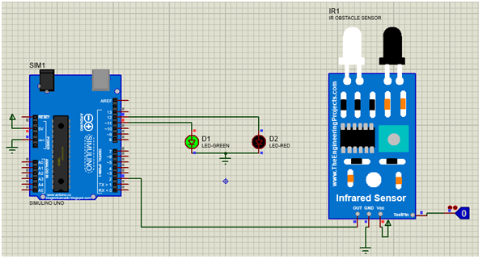

### Theory

The Arduino Uno is a widely used open-source microcontroller board that enables easy interfacing with various electronic components such as sensors, LEDs, motors, and more. It is especially popular in embedded systems and DIY electronics due to its user-friendly programming environment and strong community support. In this experiment, we will be interfacing an Infrared (IR) sensor with the Arduino Uno to detect objects and control an LED as an output indicator.
An IR sensor typically consists of an IR LED (transmitter) and a photodiode or phototransistor (receiver). It works on the principle of reflection: when an object comes close to the sensor, the IR rays emitted by the transmitter are reflected back and detected by the receiver. This detection changes the sensor’s output state.
When the IR sensor detects an object (i.e., IR light is reflected back), it usually sends a LOW signal (0V) on its output pin. When no object is detected, it sends a HIGH signal (5V). This digital output can be read by the Arduino through a digital input pin. The program will monitor this pin continuously, and based on the sensor’s output, it will toggle an LED connected to a digital output pin.
To implement this interaction, we will use the Arduino programming language (based on C/C++), which provides built-in functions to control digital input and output operations. The Arduino sketch will use pinMode(), digitalRead(), and digitalWrite() functions to control the IR sensor and LED.

Let’s briefly explain these functions:
-	pinMode(pin, mode) is used to set a pin’s direction: either as INPUT (to read data) or OUTPUT (to send data).
-	digitalRead(pin) reads the logic level on a digital input pin and returns HIGH or LOW.
-	digitalWrite(pin, value) writes a logic level (HIGH or LOW) to a digital output pin.
This experiment helps in understanding how sensors interact with microcontrollers and how we can use sensor input to drive an output. Such interfacing is fundamental in developing systems like obstacle detection robots, motion-triggered alarms, or automatic lighting systems, where sensors provide environmental data to the controller, which then takes action accordingly.

#### Schematic
Components used:
-	Arduino Uno
-	IR Sensor module
-	LED (Red)
-	220Ω Resistor
-	Jumper wires
-	Breadboard (optional)

