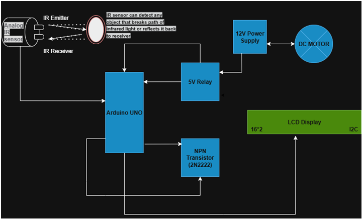

### Theory

An Analog IR sensor is a non-contact device that measures the distance to an object. It works based on the principle of triangulation. The sensor contains two key components: an IR Emitter and an IR Receiver.

###	IR Emitter
 This is an infrared LED that sends out a beam of infrared light.
### IR Receiver
 This is a phototransistor or a photodiode that detects the infrared light reflected off the object. 
 
 When an object comes into the sensor's field of view, the infrared light from the emitter reflects off the object and is detected by the receiver. The angle at which the reflected light hits the receiver depends on the object's distance. Based on this angle, the sensor's internal circuitry produces an analog voltage output.
The relationship between the output voltage and the distance is inversely proportional and non-linear. This means that as an object gets closer, the output voltage increases, but not in a straight line. Therefore, a simple linear conversion (like with the LM35 sensor) isn't sufficient.Voltage to Distance Conversion Formula
to get the actual distance in centimeters from the sensor's voltage, we use a curve-fitting formula derived from experimental data. The formula used in your code, distanceCm = 27.86 * pow (voltage, -1.154), is an approximation for a common type of analog IR sensor.
-	voltage: This is the raw analog value from the sensor, converted to voltage (from 0 to 5V).
-	27.86 and -1.154: These are constants derived from the sensor's datasheet to accurately model its non-linear behavior. The pow() function raises the voltage to a negative exponent, correctly inverting the relationship to get the distance. 
This formula converts the non-linear voltage into a linear distance reading in centimeters.
-  Arduino Uno: The Arduino reads the analog input from the sensor, processes it using the conversion formula, and then, based on a set distance threshold, sends signals to the output devices.
-	LCD Display: A 16x2 I2C LCD is used to provide visual feedback, displaying the measured distance and the status of the output devices.
-	Relay and Transistor: A relay acts as an electromechanical switch to safely control the high-power DC motor using a low-power signal from the Arduino. A transistor acts as a driver to amplify the Arduino's signal, ensuring the relay coil gets enough current to operate.

### Components Used in this Project
-	Microcontroller: Arduino Uno
-	Input Device: Analog IR Sensor
-	Output Devices: 12V DC Motor, Red LED, 16x2 LCD Display (I2C)
-	Interface Components:
-	Relay: 5V Relay Module
-	Transistor: NPN Transistor (e.g., 2N2222)
-	Resistors: 220Ω (for LED), 1kΩ (for transistor)
-	Power Sources: 12V DC Power Supply and 5V DC Power Supply (from Arduino).

### Microcontroller Connections:
The microcontroller acts as the central control unit, receiving input from the sensor and sending output signals to the devices.
-	IR Sensor: The sensor is connected to the Arduino's A0 analog I/O pin. This pin is used to sense the sensor's analog voltage output.
-	LED and Relay: The output is connected to an NPN transistor to drive the relay, where a +12V DC motor is connected as an output device. Similarly, the RED LED is also connected as an output device. 

